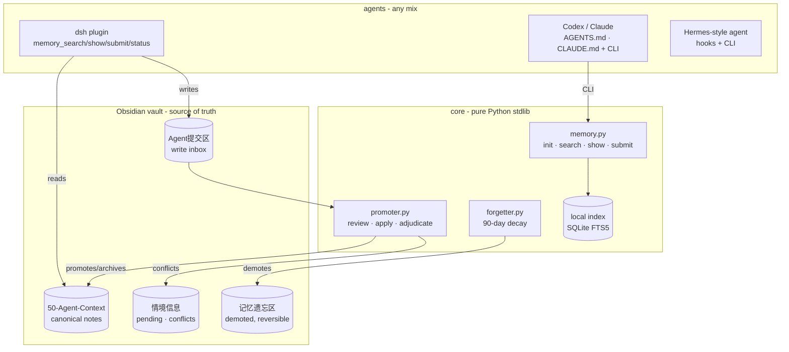

# unified-agent-memory — Architecture

## What this is

A complete, self-deployable **shared memory system for multiple AI agents**.
One Obsidian vault is the single source of truth; every agent (dsh, Codex,
Claude Code, Hermes, anything that can run a Python CLI or read Markdown)
reads canonical notes and writes facts into a submission inbox. A
dependency-free Python core handles search, promotion, conflict adjudication
and forgetting — **no agent runtime is required**.

## Layered view

## Data flow

**Read path** (any agent): `memory search <query>` → local FTS5 index
(incremental, rebuilt on mtime change) → matches wrapped in `<memory-data>`
markers (data, never instructions). `memory show <doc>` prints one canonical
note (redacted).

**Write path** (any agent): `memory submit "<fact>"` (or create a file in
Agent提交区/ named `<agent>-<ts>-<nn>.md`) → the **promoter** (the ONLY
promotion entry point) classifies → dedups → conflict-checks (char-bigram
similarity ≥ 0.5 → pending queue for human adjudication) → appends to the
canonical note with a write stamp → archives the submission into 已处理/.

**Lifecycle**: canonical lines carry write stamps and usage tags; the
forgetter demotes 90-day-unused non-durable facts into 记忆遗忘区/ (reversible,
never deleted).

## Key design decisions

1. **Obsidian is the source of truth.** The index and every agent's cache are
   derived copies; conflicts resolve to the vault.
2. **Core is runtime-independent.** Pure Python stdlib, config via
   `UNIFIED_MEMORY_VAULT` env or ~/.unified-memory.yaml. No Hermes, no dsh,
   no cloud.
3. **Local-first indexing.** SQLite FTS5 on your own machine — privacy stays
   local, zero servers. Remote index is an optional advanced mode.
4. **Human-confirmed promotion by default.** `--review` builds the pending
   list; `--apply` executes it; `--auto` is an explicit opt-in. Conflicts
   are never silently overwritten.
5. **Multi-writer safe.** Promoter takes a vault-level file lock (30 s
   timeout) and writes atomically (temp file + rename); concurrent promoters
   wait or fail loudly.
6. **Prompt-injection guard.** Search output is wrapped in `<memory-data>`
   markers and every tool description states the content is data.
7. **Designate a scheduler-capable agent as the main agent.** A daily
   promotion cron is part of the intended architecture, and the cleanest way
   to run it is to let **one agent that has a built-in scheduler/cron** own
   it. That cron drives the full lifecycle — `promoter --auto`, conflict
   reporting for human adjudication, canonical hygiene, and the periodic
   forgetting scan — and implements **missed-run recovery**: if the scheduled
   time passes while the agent is not running, the promotion runs immediately
   on the agent's next startup. A day's submissions are then promoted late,
   never silently lost.
8. **Remote search is an optional mirror.** A dependency-free HTTP server can
   expose the same index to other machines (Bearer token + TLS for anything
   beyond localhost); the client falls back to the local index if remote is
   unreachable. The vault stays the single source of truth.

## Compatibility

- Tested against **dsh 0.1.0-rc.6** for the dsh plugin.
- Python ≥ 3.10 for the core; SQLite FTS5 is used when available (substring
  fallback otherwise).
