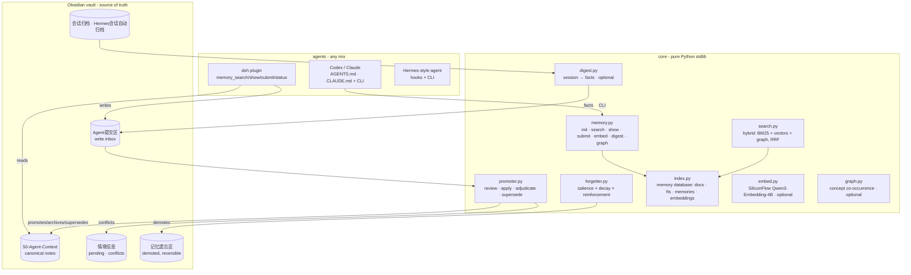

# unified-agent-memory — Architecture

## What this is

A complete, self-deployable **shared memory system for multiple AI agents**.
One Obsidian vault is the single source of truth; every agent (dsh, Codex,
Claude Code, Hermes, anything that can run a Python CLI or read Markdown)
reads canonical notes and writes facts into a submission inbox. A
dependency-free Python core handles search, promotion, conflict adjudication,
forgetting and — optionally — semantic embedding, a concept graph and
session-digest extraction. **No agent runtime is required.**

The design fuses the strongest ideas from two open-source agent-memory
projects into the original vault-first model:

- from **rohitg00/agentmemory**: hybrid retrieval (BM25 + vectors + graph
  fused by weighted RRF), versioned supersession, memory typing with salience,
  token-budget output, access-reinforced forgetting;
- from **TencentDB-Agent-Memory**: the L0–L3 memory pyramid, per-agent memory
  records (type/importance/version/provenance), and BM25-by-default with
  embeddings as an optional enhancement.

## Layered view

## Memory database (derived copy)

The SQLite index (`~/.unified-memory/index-<vault-hash>.db`) is a **derived
copy** of the vault, rebuilt incrementally from content digests. It holds:

| Table | Purpose |
|---|---|
| `docs` | per-note digest → incremental rebuild |
| `fts` | FTS5/BM25 over note content (legacy search) |
| `fts_mem` | per-line FTS5 for the BM25 retrieval stream |
| `memories` | one record per canonical fact line: `type`, `importance`, `status`, `version`, `superseded_by`, `source_agent`, `project`, `created_at`, `updated_at`, `access_count` |
| `embeddings` | Float32 vectors per memory line (optional) |
| `access_log` | read receipts → reinforcement scoring |
| `graph_nodes` / `graph_edges` | optional concept co-occurrence graph |
| `audit` | provenance/accountability for mutations |

Memory `type` is rule-classified (preference / architecture / pattern / bug /
workflow / fact / other); `importance` is its salience (0.9 … 0.4). Lines
under a `已取代` heading are indexed as `superseded`.

## Memory pyramid (L0–L3)

| Layer | Vault location | Meaning |
|---|---|---|
| L0 | 会话归档/ · Hermes会话自动归档/ | raw session history |
| L1 | canonical note lines (memories table) | atomic durable facts |
| L2 | 情境信息/ | pending · conflicts · scenarios |
| L3 | 我的偏好摘要 · 工程执行规则 · UI审美准则 … | stable profiles & doctrine |

The pyramid is **conceptual**: physical files stay in the user's curated
layout; the index/model layer organizes content across layers.

## Lifecycle

1. **Write** — `memory submit` (or any file in `Agent提交区/`) → inbox.
2. **Digest (optional, default on)** — `digest.py` summarizes archived
   sessions into durable facts via a small LLM call and drops them into the
   inbox (redacted, credential-checked, cursor-idempotent).
3. **Promote** — the promoter classifies (English + Chinese rules), dedups
   (char-bigram similarity), detects **supersession** (replacement cues such as
   “改用/迁移到/instead of” move the old line under a `已取代` section) and
   routes genuine contradictions to the conflict queue for human adjudication.
   Default is human-confirmed: `--review` → `--apply`; `--auto` is opt-in.
4. **Forget** — a line is demoted to `记忆遗忘区/` (reversible, never deleted)
   when `score = importance × (floor + decay) + access-reinforcement` drops
   below threshold, it is old enough, and it is not a durable/protected topic.
   High-importance knowledge (prefs/architecture/rules) persists indefinitely.
5. **Recall** — hybrid search fuses BM25 + vectors + graph with weighted RRF,
   diversifies per note, and caps output by a token budget. Everything is
   wrapped in `<memory-data>` markers and redacted.

## Interfaces

- **CLI** — `memory init|search|show|submit|status|embed|digest|graph`
- **dsh plugin** — `memory_search` (add `hybrid=true` for semantic search),
  `memory_show`, `memory_submit`, `memory_status`
- **Hermes integration** — `daily_cron.py` (promote/repair/forget),
  `archive_session.py`, `inject_context.py`
- **Remote index** (optional) — HTTP server exposing the same index with Bearer
  auth; client falls back to local on failure.

## Key design decisions

1. **Obsidian is the source of truth.** The index and every agent's cache are
   derived copies; conflicts resolve to the vault.
2. **Core is runtime-independent.** Pure Python stdlib; config via
   `UNIFIED_MEMORY_VAULT` env or `~/.unified-memory.yaml`.
3. **Local-first indexing.** SQLite on your own machine; embeddings are an
   optional semantic layer (SiliconFlow), stored locally, and BM25 remains the
   default when the provider is unavailable.
4. **Human-confirmed promotion by default.** `--review` builds the pending
   list; `--apply` executes it; conflicts are never silently overwritten;
   supersession keeps history under `已取代`.
5. **Multi-writer safe.** Vault-level file lock + atomic writes; the promoter
   re-checks dedup under the lock.
6. **Privacy at the boundary.** Credential-shaped text is redacted before it
   reaches the index, the LLM, or any output; submissions are rejected if they
   contain plaintext credentials.
7. **Prompt-injection guard.** Search output is wrapped in `<memory-data>`
   markers and every tool description states the content is data.
8. **Everything reversible.** Forgetting demotes to `记忆遗忘区/`; supersession
   moves old lines under `已取代`; migration backs up the vault first and is
   verified against a content baseline.

## Migration & verification

Migration is reversible and content-preserving:

1. Back up `50-Agent-Context/` and record a baseline manifest (sha256 per file).
2. Rebuild the memory database: `memory status` (or any search) creates/upgrades
   the per-vault index from the vault.
3. Enrich embeddings (optional): `memory embed`.
4. Verify: the baseline manifest is unchanged (no content touched) and
   `memory search` / `memory search --hybrid` return at least what they did
   before.

The CLI commands are idempotent and incremental (content-digest based), so the
whole procedure can be re-run at any time without side effects.

## Compatibility

- dsh 0.1.0-rc.6 plugin; Python ≥ 3.10 for the core; SQLite FTS5 when
  available (substring fallback otherwise).
- SiliconFlow embeddings: `Qwen/Qwen3-Embedding-4B`, 1024 dims (optional; API
  key in `~/.unified-memory/secrets.yaml`, permissions 0600 / user-only ACL).
